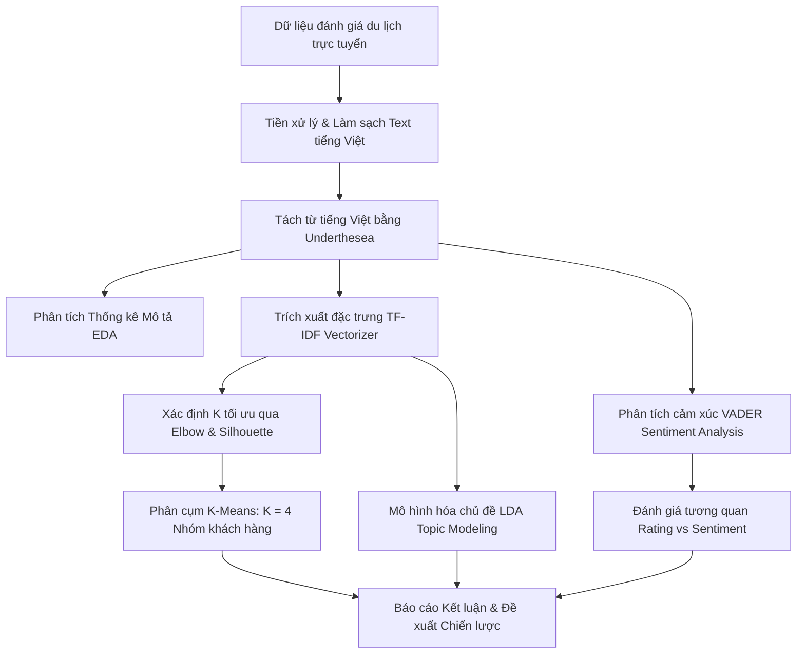

# 🏨 ĐỀ TÀI 8.1: KHAI THÁC DỮ LIỆU DU LỊCH TRỰC TUYẾN ĐỂ PHÂN TÍCH XU HƯỚNG LỰA CHỌN ĐIỂM ĐẾN

[](https://www.python.org/)
[](https://jupyter.org/)
[](https://scikit-learn.org/)
[](https://pandas.pydata.org/)
[](https://github.com/magistr-nlp/underthesea)

> **Dự án nghiên cứu & ứng dụng Khai phá dữ liệu (Data Mining), Xử lý ngôn ngữ tự nhiên (NLP) và Học máy không giám sát (Unsupervised Machine Learning)** nhằm phân tích đánh giá của du khách trên các nền tảng trực tuyến, xác định các yếu tố chi phối mức độ hài lòng và khai phá xu hướng lựa chọn điểm đến du lịch, khách sạn.

---

## 📌 MỤC LỤC
- [1. Đặt Vấn Đề & Mục Tiêu](#1-đặt-vấn-đề--mục-tiêu)
- [2. Bộ Dữ Liệu Nghiên Cứu](#2-bộ-dữ-liệu-nghiên-cứu)
- [3. Công Cụ & Thư Viện Sử Dụng](#3-công-cụ--thư-viện-sử-dụng)
- [4. Kiến Trúc Quy Trình Triển Khai (Pipeline)](#4-kiến-trúc-quy-trình-triển-khai-pipeline)
- [5. Các Giai Đoạn Thực Hiện Chi Tiết](#5-các-giai-đoạn-thực-hiện-chi-tiết)
  - [Bước 1: Khám phá & Tiền xử lý dữ liệu](#bước-1-khám-phá--tiền-xử-lý-dữ-liệu)
  - [Bước 2: Phân tích thống kê mô tả (EDA)](#bước-2-phân-tích-thống-kê-mô-tả-eda)
  - [Bước 3: Trích xuất đặc trưng TF-IDF](#bước-3-trích-xuất-đặc-trưng-tf-idf)
  - [Bước 4: Phân cụm khách hàng với K-Means](#bước-4-phân-cụm-khách-hàng-với-k-means)
  - [Bước 5: Phân tích cảm xúc (Sentiment Analysis)](#bước-5-phân-tích-cảm-xúc-sentiment-analysis)
  - [Bước 6: Mô hình hóa chủ đề (Topic Modeling - LDA)](#bước-6-mô-hình-hóa-chủ-đề-topic-modeling---lda)
- [6. Kết Quả Nghiên Cứu & Đánh Giá](#6-kết-quả-nghiên-cứu--đánh-giá)
- [7. Đề Xuất & Chiến Lược Kinh Doanh](#7-đề-xuất--chiến-lược-kinh-doanh)
- [8. Hướng Dẫn Cài Đặt & Sử Dụng](#8-hướng-dẫn-cài-đặt--sử-dụng)

---

## 1. ĐẶT VẤN ĐỀ & MỤC TIÊU

### 1.1. Bối cảnh thực tiễn
Trong kỷ nguyên số, du khách thường dựa vào các đánh giá trực tuyến (Online Travel Reviews) trên Booking.com, TripAdvisor, Agoda, Google Maps trước khi đưa ra quyết định đặt phòng và lựa chọn điểm đến. Việc thấu hiểu cảm xúc, nhu cầu và những kỳ vọng của khách hàng thông qua dữ liệu văn bản là chìa khóa then chốt để các nhà quản trị du lịch và khách sạn cải thiện chất lượng dịch vụ, tối ưu hóa trải nghiệm và xây dựng chiến lược tiếp thị mục tiêu.

### 1.2. Mục tiêu nghiên cứu
- **Thu thập & Chuẩn hóa** dữ liệu đánh giá du lịch bằng tiếng Việt từ các nền tảng công khai.
- **Phân tích thống kê (EDA)** về độ dài văn bản, phân bố xếp hạng (Rating 1 - 5 sao).
- **Trích xuất đặc trưng từ vựng** quan trọng chi phối trải nghiệm của du khách bằng kỹ thuật TF-IDF (Unigram + Bigram).
- **Phân khúc thị trường khách hàng** bằng giải thuật phân cụm K-Means nhằm nhận diện các nhóm hành vi khách du lịch.
- **Phân tích sắc thái tình cảm (Sentiment Analysis)** và đánh giá mức độ tương quan giữa điểm cảm xúc và xếp hạng sao.
- **Mô hình hóa chủ đề tiềm ẩn (Topic Modeling)** bằng thuật toán LDA (Latent Dirichlet Allocation).
- **Đề xuất chiến lược hành động** theo lộ trình ngắn hạn, trung hạn và dài hạn cho doanh nghiệp kinh doanh dịch vụ lưu trú.

---

## 2. BỘ DỮ LIỆU NGHIÊN CỨU

- **Nguồn gốc:** Dữ liệu đánh giá khách sạn, điểm đến du lịch thu thập từ các nền tảng du lịch trực tuyến công khai.
- **Quy mô tập dữ liệu:** 1.019 đánh giá văn bản tiếng Việt hoàn chỉnh.
- **Cấu trúc trường thông tin:**
  - `STT`: Mã số định danh của đánh giá.
  - `Comment_VI`: Nội dung nhận xét, phản hồi của du khách bằng tiếng Việt.
  - `Rating`: Điểm đánh giá mức độ hài lòng (thang điểm 1 đến 5 sao).

---

## 3. CÔNG CỤ & THƯ VIỆN SỬ DỤNG

| Lĩnh vực | Thư viện / Công nghệ | Vai trò & Mục đích sử dụng |
| :--- | :--- | :--- |
| **Thu thập & Đọc dữ liệu** | `pandas`, `numpy`, `regex` | Thao tác trên DataFrame, xử lý mảng, biểu thức chính quy |
| **Xử lý ngôn ngữ tự nhiên** | `underthesea` | Tách từ (Word Tokenization) chuyên dụng cho tiếng Việt |
| **Khai thác đặc trưng & ML** | `scikit-learn` | `TfidfVectorizer`, `KMeans`, `LatentDirichletAllocation` |
| **Phân tích cảm xúc** | `vaderSentiment` | Đo lường độ phân cực và tính điểm Sentiment Compound Score |
| **Trực quan hóa đồ thị** | `matplotlib`, `seaborn`, `plotly` | Vẽ biểu đồ cột, biểu đồ tròn, boxplot, ma trận tương quan |

---

## 4. KIẾN TRÚC QUY TRÌNH TRIỂN KHAI (PIPELINE)



---

## 5. CÁC GIAI ĐOẠN THỰC HIỆN CHI TIẾT

### Bước 1: Khám phá & Tiền xử lý dữ liệu
- Khử trùng lặp (`drop_duplicates`) và xử lý giá trị khuyết thiếu (`dropna`).
- Chuẩn hóa văn bản: Chuyển về chữ thường (`lower`), loại bỏ URL, email, ký tự đặc biệt, lọc khoảng trắng thừa.
- Tự động sửa các lỗi dính từ phổ biến (`kháchsạn` ➔ `khách sạn`, `vịtrí` ➔ `vị trí`).
- Chuẩn hóa dấu ngắt câu, viết hoa đầu câu theo cú pháp tiếng Việt chuẩn.
- Tách từ ghép tiếng Việt với `underthesea.word_tokenize`.

### Bước 2: Phân tích thống kê mô tả (EDA)
- **Điểm đánh giá trung bình:** `4.25 / 5.0 ⭐` (Độ lệch chuẩn $\sigma = 1.20$, Trung vị $\text{Median} = 5.0$).
- **Phân bố xếp hạng:**
  - ⭐ **5 sao:** 646 đánh giá (`63.40%`)
  - ⭐ **4 sao:** 170 đánh giá (`16.68%`)
  - ⭐ **3 sao:** 77 đánh giá (`7.56%`)
  - ⭐ **2 sao:** 64 đánh giá (`6.28%`)
  - ⭐ **1 sao:** 62 đánh giá (`6.08%`)
- **Độ dài đánh giá:** Trung bình đạt 383 ký tự (~92 từ). Nhận xét chi tiết nhất lên tới 4.922 ký tự.

### Bước 3: Trích xuất đặc trưng TF-IDF
- Cấu hình ma trận đặc trưng: Giới hạn `max_features = 1000`, `ngram_range = (1, 2)` (kết hợp unigram và bigram), `min_df = 2`, `max_df = 0.8`.
- Kết quả tạo ma trận thưa với mật độ `7.17%`, làm nổi bật các từ khóa có tính phân biệt cao.

### Bước 4: Phân cụm khách hàng với K-Means
- Sử dụng phương pháp **Elbow Method** và **Silhouette Score** duyệt qua $K \in [2, 10]$ để tìm điểm cân bằng tối ưu.
- Lựa chọn $K = 4$ cụm đại diện cho 4 phân khúc khách du lịch:
  - **Cụm 0 (27.28% - Rating TB: 2.92/5):** Nhóm khách hàng chưa hài lòng, tập trung phản ánh chất lượng phòng nghỉ, cách âm, thiết bị, tiếng ồn về đêm.
  - **Cụm 1 (17.17% - Rating TB: 4.99/5):** Nhóm khách hàng cực kỳ hài lòng, đề cao thái độ nhiệt tình, thân thiện của nhân viên và sự sạch sẽ của phòng.
  - **Cụm 2 (20.71% - Rating TB: 4.25/5):** Nhóm khách hàng ấn tượng mạnh về vị trí trung tâm thuận tiện di chuyển, cảnh quan và trải nghiệm chung.
  - **Cụm 3 (34.84% - Rating TB: 4.92/5):** Nhóm khách hàng trải nghiệm toàn diện, đánh giá cao ẩm thực/bữa sáng, dịch vụ chuyên nghiệp và chất lượng tiện nghi.

### Bước 5: Phân tích cảm xúc (Sentiment Analysis)
- Áp dụng thang đo cảm xúc VADER tính toán điểm Compound Score:
  - **Tích cực (Score $\ge 0.05$):** 113 đánh giá (`11.09%`)
  - **Trung lập ($-0.05 < \text{Score} < 0.05$):** 847 đánh giá (`83.12%`)
  - **Tiêu cực (Score $\le -0.05$):** 59 đánh giá (`5.79%`)
- Phân tích tương quan khẳng định: Mức độ cảm xúc trong văn bản nhận xét phản ánh trực tiếp và đồng biến với mức điểm Rating thực tế.

### Bước 6: Mô hình hóa chủ đề (Topic Modeling - LDA)
Ứng dụng thuật toán **Latent Dirichlet Allocation (LDA)** khám phá 5 chủ đề cốt lõi mà khách hàng quan tâm:
1. 📍 **Vị trí & Tiện ích:** Khoảng cách tới trung tâm, chợ, điểm tham quan.
2. 👨‍💼 **Dịch vụ & Thái độ nhân viên:** Sự hỗ trợ nhanh nhẹn, chuyên nghiệp, chu đáo.
3. 🛏️ **Chất lượng phòng & Vệ sinh:** Giường êm, phòng thơm mát, phòng tắm sạch sẽ.
4. 🌟 **Trải nghiệm tổng thể:** Không gian nghỉ dưỡng, mức độ thư giãn, độ hài lòng chung.
5. 💵 **Giá cả & Đánh giá:** Mức giá tương xứng với chất lượng, sự tiện lợi so với chi phí bỏ ra.

---

## 6. KẾT QUẢ NGHIÊN CỨU & ĐÁNH GIÁ

| Chỉ số / Tiêu chí | Kết quả đạt được | Ý nghĩa thực tiễn |
| :--- | :--- | :--- |
| **Tỷ lệ khách hài lòng (Rating $\ge 4$)** | **80.08%** | Thương hiệu khách sạn và điểm đến giữ được uy tín tốt trong mắt du khách |
| **Tỷ lệ không hài lòng (Rating $\le 2$)** | **12.36%** | Tồn tại nhóm khách hàng gặp trải nghiệm xấu cần quy trình xử lý khủng hoảng |
| **Yếu tố tác động lớn nhất (+)** | Vị trí trung tâm & Thái độ nhân viên | Điểm chạm vàng để tăng trưởng tỷ lệ quay lại và nhận xét 5 sao |
| **Yếu tố tác động tiêu cực nhất (-)** | Tiếng ồn, cách âm kém, máy lạnh, wifi | Điểm nghẽn cần ưu tiên bảo dưỡng kỹ thuật định kỳ |

---

## 7. ĐỀ XUẤT & CHIẾN LƯỢC KINH DOANH

```
                    LỘ TRÌNH CHIẾN LƯỢC PHÁT TRIỂN
┌──────────────────────┬──────────────────────┬──────────────────────┐
│  Ngắn Hạn (1-3 Th.)  │  Trung Hạn (3-6 Th.) │  Dài Hạn (6-12 Th.)  │
├──────────────────────┼──────────────────────┼──────────────────────┤
│ • Khảo sát cách âm   │ • Phát triển chương  │ • Nâng cấp tổng thể  │
│ • Sửa chữa trang bị  │   trình Loyalty/VIP  │   cơ sở vật chất     │
│ • Đào tạo nhân viên  │ • Nâng cấp hệ thống  │ • Xây dựng hệ thống  │
│ • Tối ưu mạng Wifi   │   điều hòa & phòng   │   Dynamic Pricing    │
│ • Thiết lập bộ phận  │ • Cá nhân hóa thực   │ • Xây dựng ứng dụng  │
│   CSKH phản hồi tức  │   đơn điểm tâm theo  │   Mobile Booking     │
│   thì cho review xấu │   khẩu vị từng vùng  │   riêng biệt         │
└──────────────────────┴──────────────────────┴──────────────────────┘
```

---

## 8. HƯỚNG DẪN CÀI ĐẶT & SỬ DỤNG

### Yêu cầu hệ thống
- Python >= 3.10
- Jupyter Notebook / Jupyter Lab / Google Colab

### Cài đặt thư viện phụ thuộc
```bash
pip install pandas numpy matplotlib seaborn scikit-learn underthesea vaderSentiment
```

### Chạy Notebook
1. Clone repository về máy:
   ```bash
   git clone https://github.com/Stormaka/hoanonichan.git
   cd hoanonichan
   ```
2. Khởi chạy Jupyter Notebook:
   ```bash
   jupyter notebook "DE_TAI_8_1_Phan_Tich_Du_Lich (2).ipynb"
   ```
3. Chạy tuần tự từng Cell (hoặc chọn `Cell` ➔ `Run All`) để theo dõi quy trình xử lý, phân cụm và các biểu đồ phân tích.

---

## 👨‍💻 TÁC GIẢ & THÔNG TIN DỰ ÁN
- **Đề tài:** 8.1 - Khai thác dữ liệu du lịch trực tuyến để phân tích xu hướng lựa chọn điểm đến
- **Repository:** [Stormaka/hoanonichan](https://github.com/Stormaka/hoanonichan)
- **Hoàn thành:** Năm 2026